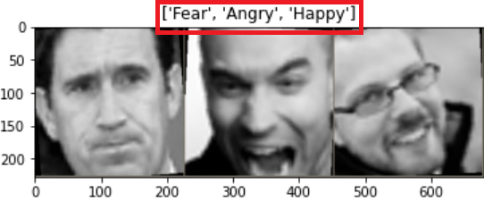

## Domain-Adaptation - Learning from Male Faces to Female Faces
We built this neural network to recognize emotion from a facial expression. There are seven emotional states: neutral, joy, sadness, surprise, anger, fear, disgust.

While the men faces are labelled

women faces aren't:

To classify the women facial expressions and solve the lack of labelled data, we used an advanced technique: domain-adaptation (by Ganin et al. see description below)

### Domain Adaptation - Model Architecture
An implementation of the article ["Domain-Adversarial Training of Neural Networks" (2016)](https://arxiv.org/pdf/1505.07818.pdf) by Ganin et al. This article deals with the ["Domain Adaptation"](https://en.wikipedia.org/wiki/Domain_adaptation) problem which often happens in machine learning.

The goal of domain adaptation is to transfer the knowledge of a well-performing model from one source distribution to a different but related data distribution. The model is trained on a source dataset and applied to a target dataset (usually unlabeled).

The suggested neural network in the article consists of two classifiers at the training stage: label classification and a domain classification. Each classifier has its loss (classification loss and the domain confusion loss accordingly). 

That way, we achieve in one go two tasks for the network:
1. Classifying the data by supervised labels and 
2. Becoming invariant to the domain differences and "forgetting" the features which represent the difference between the domains

The proposed architecture includes a deep feature extractor (green) and a deep
label predictor (blue), which together form a standard feed-forward architecture.

Unsupervised domain adaptation is achieved by adding a domain classifier (red) connected to the feature extractor via a gradient reversal layer that multiplies the gradient by a particular negative constant during the backpropagation-based training. 

Other than that change, the training proceeds standardly and minimizes the label prediction loss (for source examples) and the domain classification loss (for all samples). 

Gradient reversal ensures that the feature distributions over the two
domains are made similar (as indistinguishable as possible for the domain classifier), thus resulting in the domain-invariant features.

### Project files
1. dataLoaders.py - DataLoader object
2. model.py - all functions that create the model(network) architecture
3. network.py
4. trainer.py - Trainer object. Contains the training, evaluation and test functions
5. utils.py
